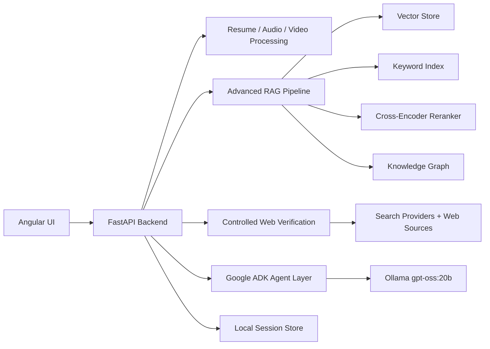

# AI Interview Coach

Advanced local-first multimodal RAG project for resume analysis, mock interviews, skill scoring, grounded feedback, and web-verified factual checking.

The app includes:

- Angular interview dashboard for resume/JD upload, live camera recording, chat, scoring, evidence, and web verification
- Python FastAPI backend
- Advanced RAG pipeline with section-aware chunking, hybrid retrieval, metadata filtering, parent-child retrieval, query rewriting, reranking hooks, graph extraction, and evaluation stubs
- Controlled web verification that checks answer claims against online sources and returns citations
- Ollama local LLM support for `gpt-oss:20b`
- Google ADK-ready agent files

## Architecture



## Folder Structure

```text
.
|-- backend/
|   |-- app/
|   |   |-- agents/          # ADK-compatible interviewer/evaluator agents
|   |   |-- api/             # FastAPI routes
|   |   |-- core/            # Settings and logging
|   |   |-- models/          # Domain dataclasses
|   |   |-- multimodal/      # Resume, audio, video processing
|   |   |-- rag/             # Advanced RAG building blocks
|   |   |-- services/        # Interview orchestration and local LLM client
|   |   |-- storage/         # In-memory repositories
|   |   `-- web/             # Web search, fetching, and claim verification
|   `-- tests/
|-- frontend/
|   `-- src/app/             # Angular standalone UI
|-- docs/
`-- scripts/
```

## Prerequisites

- Python 3.10+
- Node.js 20+
- Ollama installed locally
- Enough RAM/VRAM for your local model

Pull your local model:

```powershell
ollama pull gpt-oss:20b
```

## Backend Setup

```powershell
cd backend
python -m venv .venv
.\.venv\Scripts\Activate.ps1
python -m pip install --upgrade pip
pip install -e ".[dev,adk,rag,multimodal]"
copy ..\.env.example .env
python -m uvicorn app.main:app --host 127.0.0.1 --port 8000
```

If you only want the lightweight MVP first:

```powershell
pip install -e ".[dev]"
```

The lightweight mode uses deterministic hashing embeddings and heuristic reranking, so it still works before sentence-transformers, Whisper, Qdrant, or Neo4j are configured.

## Frontend Setup

```powershell
cd frontend
npm install
npm start
```

Open `http://127.0.0.1:4200`.

## Web Verification

The project does not give the LLM unrestricted internet access. The backend exposes a controlled verification tool:

1. Extract concrete claims from the answer.
2. Search the web through a configured provider.
3. Fetch source text when allowed.
4. Compare claims against source terms.
5. Return verdicts, citations, limitations, and a source-backed corrected answer.

Verdicts are intentionally conservative:

- `verified`: public sources strongly support the claim
- `partially_verified`: sources support part of the claim
- `needs_review`: sources contain caution/deprecation signals
- `not_verified`: sources did not prove the claim
- `no_sources`: no usable sources were found

Default no-key provider:

```env
WEB_SEARCH_PROVIDER=duckduckgo
WEB_SEARCH_ENABLED=true
WEB_FETCH_PAGES=true
```

Production-friendly providers:

```env
WEB_SEARCH_PROVIDER=brave
BRAVE_SEARCH_API_KEY=your-key
```

```env
WEB_SEARCH_PROVIDER=tavily
TAVILY_API_KEY=your-key
```

Test the verifier directly:

```powershell
Invoke-RestMethod -Method Post `
  -Uri http://127.0.0.1:8000/verification/check `
  -ContentType "application/json" `
  -Body '{"question":"What is Angular?","role_title":"Frontend Engineer","answer":"Angular uses components and templates to build web applications.","max_claims":3}'
```

In the UI, turn on `Web verification`, type an answer, and either click `Verify` for a draft check or `Send` to include verification in interview scoring.

## ADK Agent Setup

ADK is optional for the FastAPI app, but the agent files are ready for it:

```powershell
cd backend
.\.venv\Scripts\Activate.ps1
$env:PYTHONUTF8 = "1"
pip install -e ".[adk]"
adk web app\agents
```

This project follows the ADK local-model pattern: install `google-adk`, use LiteLLM, and set Ollama models with the `ollama_chat/...` provider.

## Suggested Build Order

1. Run backend with hashing embeddings.
2. Run Angular UI and upload resume/JD files.
3. Start Ollama and verify generated questions.
4. Test `/verification/check` and turn on web verification in the UI.
5. Add sentence-transformers embeddings and cross-encoder reranking.
6. Add faster-whisper transcription.
7. Turn on Qdrant/Neo4j with `docker compose --profile advanced up`.
8. Add RAGAS-style evaluation datasets.
9. Later, swap local-only config for cloud APIs.

## Useful Endpoints

- `GET /health`
- `GET /rag/stages`
- `POST /documents/upload`
- `POST /interviews/start`
- `POST /interviews/{session_id}/answer`
- `POST /interviews/{session_id}/video`
- `GET /interviews/{session_id}/report`
- `POST /verification/check`

## Notes

This is intentionally local-first. The default path keeps your resume, videos, transcripts, and scoring data on your machine. Web verification only sends extracted answer claims to the configured search provider when enabled.
