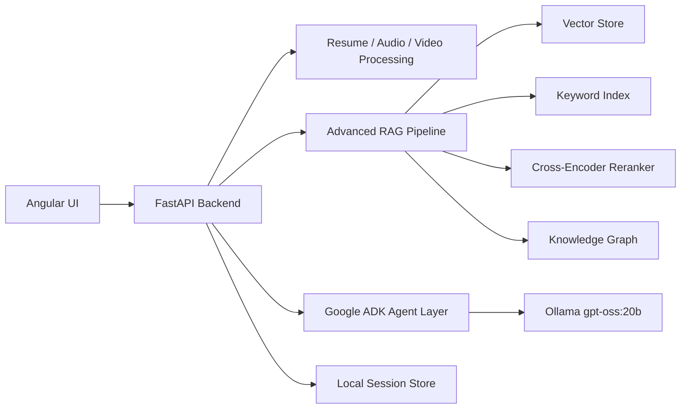

# AI Interview Coach

Advanced local-first multimodal RAG project for resume analysis, mock interviews, skill scoring, and grounded feedback.

The first version runs offline on your machine with:

- Angular UI for resume/JD upload, live camera recording, interview chat, and score dashboard
- Python FastAPI backend
- RAG pipeline with section-aware chunking, hybrid retrieval, metadata filtering, parent-child retrieval, query rewriting, reranking hooks, graph extraction, and evaluation stubs
- Ollama local LLM support for `gpt-oss:20b`
- Google ADK-ready agent files that can run through `adk web` after installing `google-adk`

## Architecture



## Folder Structure

```text
.
├── backend/
│   ├── app/
│   │   ├── agents/          # ADK-compatible interviewer/evaluator agents
│   │   ├── api/             # FastAPI routes
│   │   ├── core/            # Settings and logging
│   │   ├── models/          # Domain dataclasses
│   │   ├── multimodal/      # Resume, audio, video processing
│   │   ├── rag/             # Advanced RAG building blocks
│   │   ├── services/        # Interview orchestration and local LLM client
│   │   └── storage/         # In-memory repositories
│   └── tests/
├── frontend/
│   └── src/app/             # Angular standalone UI
├── docs/
│   ├── ARCHITECTURE.md
│   ├── RAG_STAGES.md
│   └── ROADMAP.md
└── scripts/
```

## Prerequisites

- Python 3.10+
- Node.js 20+
- Ollama installed locally
- Enough RAM/VRAM for your local model

Pull your local model:

```powershell
ollama pull gpt-oss:20b
```

## Backend Setup

```powershell
cd backend
python -m venv .venv
.\.venv\Scripts\Activate.ps1
python -m pip install --upgrade pip
pip install -e ".[dev,adk,rag,multimodal]"
copy ..\.env.example .env
uvicorn app.main:app --reload --host 127.0.0.1 --port 8000
```

If you only want the lightweight MVP first:

```powershell
pip install -e ".[dev]"
```

The lightweight mode uses deterministic hashing embeddings and heuristic reranking, so it still works before sentence-transformers, Whisper, Qdrant, or Neo4j are configured.

## Frontend Setup

```powershell
cd frontend
npm install
npm start
```

Open `http://localhost:4200`.

## ADK Agent Setup

ADK is optional for the FastAPI app, but the agent files are ready for it:

```powershell
cd backend
.\.venv\Scripts\Activate.ps1
$env:PYTHONUTF8 = "1"
pip install -e ".[adk]"
adk web app\agents
```

This project follows the current ADK local-model pattern: install `google-adk`, use LiteLLM, and set Ollama models with the `ollama_chat/...` provider.

## Suggested Build Order

1. Run backend with hashing embeddings.
2. Run Angular UI and upload resume/JD files.
3. Start Ollama and verify generated questions.
4. Add sentence-transformers embeddings and cross-encoder reranking.
5. Add faster-whisper transcription.
6. Turn on Qdrant/Neo4j with `docker compose --profile advanced up`.
7. Add RAGAS-style evaluation datasets.
8. Later, swap local-only config for cloud APIs.

## Useful Endpoints

- `GET /health`
- `GET /rag/stages`
- `POST /documents/upload`
- `POST /interviews/start`
- `POST /interviews/{session_id}/answer`
- `POST /interviews/{session_id}/video`
- `GET /interviews/{session_id}/report`

## Notes

This is intentionally local-first. The code has clean seams for cloud APIs later, but the default path keeps your resume, videos, transcripts, and scoring data on your machine.

