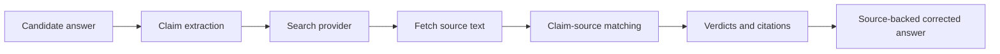

# Web Verification

This feature gives the application internet-aware checking without letting the LLM invent facts from open-ended browsing.

## Flow



## Providers

Default local-friendly mode:

```env
WEB_SEARCH_PROVIDER=duckduckgo
WEB_SEARCH_ENABLED=true
WEB_FETCH_PAGES=true
```

Production providers:

```env
WEB_SEARCH_PROVIDER=brave
BRAVE_SEARCH_API_KEY=...
```

```env
WEB_SEARCH_PROVIDER=tavily
TAVILY_API_KEY=...
```

## Testing

Run the backend, then:

```powershell
Invoke-RestMethod -Method Post `
  -Uri http://127.0.0.1:8000/verification/check `
  -ContentType "application/json" `
  -Body '{"question":"What is Angular?","answer":"Angular uses components and templates to build web applications.","role_title":"Frontend Engineer"}'
```

Expected behavior:

- Public technical facts should return `verified` or `partially_verified` with source links.
- Private claims should return `not_verified` unless they appear in public sources.
- No-source cases should not be treated as false; they should be treated as unverified.

## Safety Rules

- Do not mark an answer correct unless sources support it.
- Do not mark a personal claim false just because the web cannot prove it.
- Prefer official docs and primary sources when possible.
- Display citations so users can inspect the evidence.
